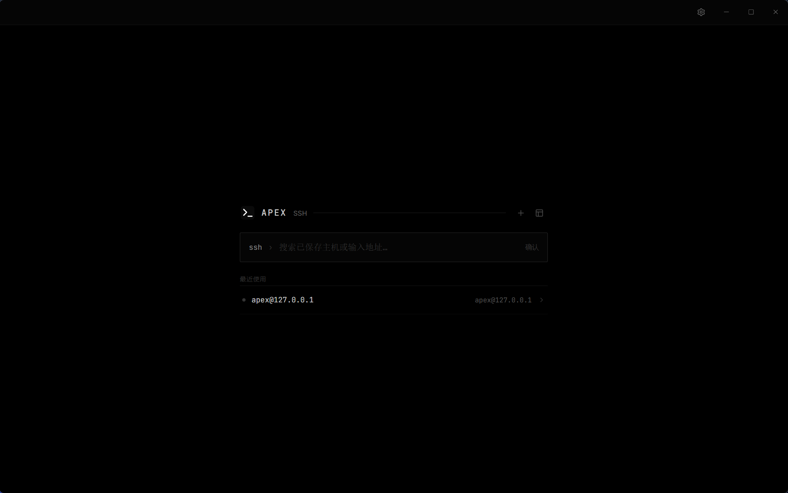

# ⚡ Apex SSH

**A clean, modern, cross-platform desktop SSH client**

Terminal · Session Management · SFTP · 简体中文 / English

[简体中文](README.md) | **English**

## ✨ Features

<table>
  <tr>
    <td width="50%">
      <h3>🗂 Multi-Session Workspace</h3>
      Manage multiple SSH sessions in tabs, with split view, session duplication, and moving sessions to standalone windows.
    </td>
    <td width="50%">
      <h3>🖥 Full Terminal Experience</h3>
      ANSI colors, vim, arrow-key history, Tab completion, Home/End, text selection, and copy/paste.
    </td>
  </tr>
  <tr>
    <td width="50%">
      <h3>📁 SFTP File Manager</h3>
      Remote panel and local/remote dual-pane modes with upload, download, drag &amp; drop, pause, resume, and conflict handling.
    </td>
    <td width="50%">
      <h3>🔗 Flexible Connection Management</h3>
      Password and private-key auth, host grouping and search, recent connections, and import from <code>~/.ssh/config</code>.
    </td>
  </tr>
  <tr>
    <td width="50%">
      <h3>🔐 Secure Credential Vault</h3>
      Passwords encrypted via the system keychain, restricted permissions on managed keys — secrets never reach the renderer process.
    </td>
    <td width="50%">
      <h3>📦 Config Migration</h3>
      Import and export host configurations; backups automatically exclude passwords, private keys, and passphrases.
    </td>
  </tr>
</table>

## 📥 Download

Get the latest version from [GitHub Releases](https://github.com/dunhanson/apex-ssh/releases/latest):

| Platform | Architecture | Format |
| --- | --- | --- |
| 🪟 Windows | x64 / arm64 | NSIS installer |
| 🐧 Linux | x64 / arm64 | `.deb` / `.rpm` |
| 🍎 macOS | x64 / Apple Silicon | DMG |

> [!NOTE]
> Public builds are not yet commercially code-signed; your OS may show a security prompt on first launch.

## 🛠 Tech Overview

The main process owns SSH, SFTP, credentials, and local data; the renderer accesses them through a restricted IPC interface.

## 📖 Documentation

Documentation is currently available in Simplified Chinese:

- [开发指南 (Developer Guide)](docs/开发指南.md)
- [构建与发布指南 (Build & Release Guide)](docs/发布指南.md)
- [参与贡献 (Contributing)](CONTRIBUTING.md)
- [安全策略 (Security Policy)](SECURITY.md)

## 📄 License

This project is licensed under the [MIT License](LICENSE).
